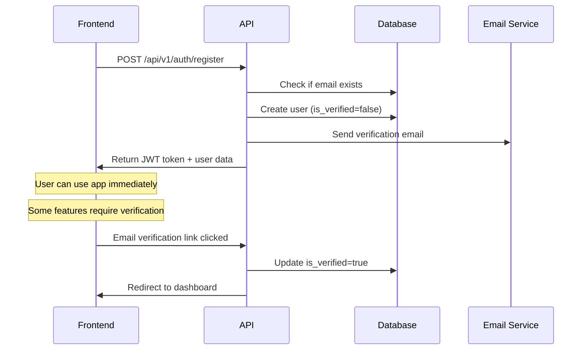
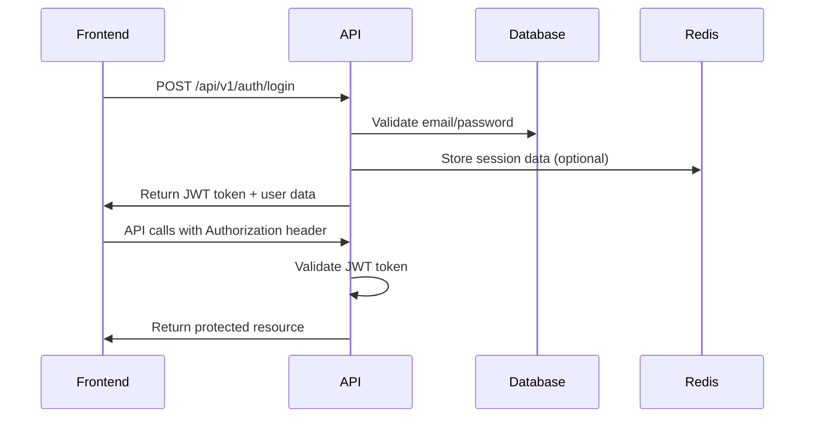
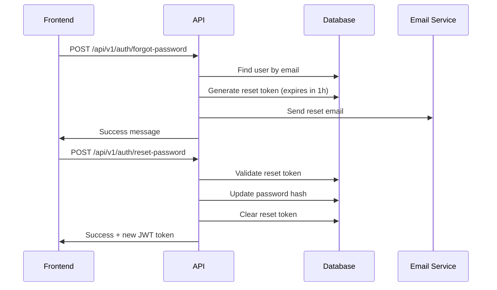

# FormFlow AI - Authentication Flow Documentation

## Overview
FormFlow AI uses JWT-based authentication with support for user registration, login, password reset, and API token management.

---

## 🔐 Authentication Methods

### JWT Token Authentication
- **Token Type**: Bearer tokens
- **Algorithm**: HS256 
- **Expiration**: 24 hours (configurable)
- **Header Format**: `Authorization: Bearer <jwt_token>`

### API Key Authentication
- **Format**: `X-API-Key: <api_key>`
- **Usage**: For webhook endpoints and server-to-server communication
- **Scope**: Limited to specific endpoints

---

## 🔄 Authentication Flow

### 1. User Registration Flow


### 2. User Login Flow  


### 3. Password Reset Flow


---

## 🛡️ Security Implementation

### Password Security
```python
# Password hashing with bcrypt
from passlib.context import CryptContext

pwd_context = CryptContext(schemes=["bcrypt"], deprecated="auto")

def hash_password(password: str) -> str:
    return pwd_context.hash(password)

def verify_password(plain_password: str, hashed_password: str) -> bool:
    return pwd_context.verify(plain_password, hashed_password)
```

### JWT Token Generation
```python
from jose import jwt
from datetime import datetime, timedelta

SECRET_KEY = os.getenv("JWT_SECRET_KEY")
ALGORITHM = "HS256"
ACCESS_TOKEN_EXPIRE_MINUTES = 1440  # 24 hours

def create_access_token(data: dict):
    to_encode = data.copy()
    expire = datetime.utcnow() + timedelta(minutes=ACCESS_TOKEN_EXPIRE_MINUTES)
    to_encode.update({"exp": expire})
    return jwt.encode(to_encode, SECRET_KEY, algorithm=ALGORITHM)
```

### Token Validation Middleware
```python
from fastapi import HTTPException, status, Depends
from fastapi.security import HTTPBearer, HTTPAuthorizationCredentials

security = HTTPBearer()

async def get_current_user(
    credentials: HTTPAuthorizationCredentials = Depends(security),
    db: Session = Depends(get_db)
):
    try:
        payload = jwt.decode(credentials.credentials, SECRET_KEY, algorithms=[ALGORITHM])
        user_id: str = payload.get("sub")
        
        if user_id is None:
            raise HTTPException(
                status_code=status.HTTP_401_UNAUTHORIZED,
                detail="Invalid authentication credentials"
            )
            
        user = db.query(User).filter(User.id == user_id).first()
        if user is None or not user.is_active:
            raise HTTPException(
                status_code=status.HTTP_401_UNAUTHORIZED,
                detail="User not found or inactive"
            )
            
        return user
        
    except JWTError:
        raise HTTPException(
            status_code=status.HTTP_401_UNAUTHORIZED,
            detail="Could not validate credentials"
        )
```

---

## 🔑 API Endpoint Details

### Registration
```http
POST /api/v1/auth/register
Content-Type: application/json

{
  "email": "user@example.com",
  "password": "securePassword123!",
  "full_name": "John Doe"
}
```

**Validation Rules:**
- Email: Valid email format, unique
- Password: Minimum 8 characters, at least 1 uppercase, 1 lowercase, 1 number
- Full name: 2-100 characters

**Response:**
```json
{
  "access_token": "eyJhbGciOiJIUzI1NiIs...",
  "token_type": "bearer",
  "expires_in": 86400,
  "user": {
    "id": "550e8400-e29b-41d4-a716-446655440000",
    "email": "user@example.com", 
    "full_name": "John Doe",
    "plan_type": "free",
    "is_verified": false,
    "created_at": "2025-01-01T10:00:00Z"
  }
}
```

### Login
```http
POST /api/v1/auth/login
Content-Type: application/json

{
  "email": "user@example.com",
  "password": "securePassword123!"
}
```

**Response:**
```json
{
  "access_token": "eyJhbGciOiJIUzI1NiIs...",
  "token_type": "bearer", 
  "expires_in": 86400,
  "user": {
    "id": "550e8400-e29b-41d4-a716-446655440000",
    "email": "user@example.com",
    "full_name": "John Doe",
    "plan_type": "pro",
    "is_verified": true
  }
}
```

### Get Current User
```http
GET /api/v1/auth/me
Authorization: Bearer <jwt_token>
```

### Refresh Token (Optional)
```http
POST /api/v1/auth/refresh
Authorization: Bearer <jwt_token>
```

---

## 🔐 Role-Based Access Control (RBAC)

### User Roles
```python
from enum import Enum

class UserRole(str, Enum):
    USER = "user"
    ADMIN = "admin"
    SUPER_ADMIN = "super_admin"

class PlanType(str, Enum):
    FREE = "free"
    PRO = "pro" 
    BUSINESS = "business"
```

### Permission Middleware
```python
def require_plan(minimum_plan: PlanType):
    def decorator(func):
        async def wrapper(current_user: User = Depends(get_current_user)):
            plan_hierarchy = {
                PlanType.FREE: 0,
                PlanType.PRO: 1, 
                PlanType.BUSINESS: 2
            }
            
            if plan_hierarchy[current_user.plan_type] < plan_hierarchy[minimum_plan]:
                raise HTTPException(
                    status_code=403,
                    detail=f"This feature requires {minimum_plan} plan or higher"
                )
            
            return await func(current_user)
        return wrapper
    return decorator

# Usage
@app.get("/api/v1/templates/premium")
@require_plan(PlanType.PRO)
async def get_premium_templates(current_user: User = Depends(get_current_user)):
    pass
```

---

## 🌐 OAuth Integration (Future)

### Planned OAuth Providers
- **Google OAuth**: For Google Forms integration
- **Microsoft OAuth**: For Microsoft Forms integration  
- **GitHub OAuth**: For developer authentication
- **Typeform OAuth**: For enhanced Typeform integration

### OAuth Flow Structure
```python
# Future implementation structure
@app.get("/auth/oauth/{provider}")
async def oauth_login(provider: str):
    # Redirect to OAuth provider
    pass

@app.get("/auth/oauth/{provider}/callback") 
async def oauth_callback(provider: str, code: str):
    # Handle OAuth callback
    # Exchange code for access token
    # Create or update user
    # Return JWT token
    pass
```

---

## 📱 Frontend Authentication Implementation

### React Context Setup
```typescript
interface AuthContextType {
  user: User | null;
  token: string | null;
  login: (email: string, password: string) => Promise<void>;
  register: (userData: RegisterData) => Promise<void>;
  logout: () => void;
  isAuthenticated: boolean;
  isLoading: boolean;
}

export const AuthContext = createContext<AuthContextType | undefined>(undefined);
```

### Token Storage
```typescript
// Store in httpOnly cookie (recommended)
const storeToken = (token: string) => {
  document.cookie = `auth_token=${token}; Path=/; HttpOnly; Secure; SameSite=Strict`;
};

// Or localStorage (less secure but simpler)
const storeToken = (token: string) => {
  localStorage.setItem('auth_token', token);
};
```

### API Client Setup
```typescript
import axios from 'axios';

const apiClient = axios.create({
  baseURL: process.env.NEXT_PUBLIC_API_URL,
});

// Add token to all requests
apiClient.interceptors.request.use((config) => {
  const token = localStorage.getItem('auth_token');
  if (token) {
    config.headers.Authorization = `Bearer ${token}`;
  }
  return config;
});

// Handle token expiration
apiClient.interceptors.response.use(
  (response) => response,
  (error) => {
    if (error.response?.status === 401) {
      // Token expired, redirect to login
      window.location.href = '/login';
    }
    return Promise.reject(error);
  }
);
```

---

## 🧪 Testing Authentication

### Test User Accounts
```python
# Test data creation
test_users = [
    {
        "email": "admin@formflow.ai",
        "password": "AdminPass123!",
        "role": UserRole.ADMIN,
        "plan_type": PlanType.BUSINESS
    },
    {
        "email": "user@example.com", 
        "password": "UserPass123!",
        "role": UserRole.USER,
        "plan_type": PlanType.FREE
    },
    {
        "email": "pro@example.com",
        "password": "ProPass123!",
        "role": UserRole.USER,
        "plan_type": PlanType.PRO
    }
]
```

### Authentication Test Cases
```python
import pytest
from fastapi.testclient import TestClient

def test_register_new_user(client: TestClient):
    response = client.post("/api/v1/auth/register", json={
        "email": "newuser@example.com",
        "password": "NewPass123!",
        "full_name": "New User"
    })
    assert response.status_code == 200
    assert "access_token" in response.json()

def test_login_valid_credentials(client: TestClient):
    response = client.post("/api/v1/auth/login", json={
        "email": "user@example.com",
        "password": "UserPass123!"
    })
    assert response.status_code == 200
    assert "access_token" in response.json()

def test_access_protected_endpoint(client: TestClient, auth_headers):
    response = client.get("/api/v1/auth/me", headers=auth_headers)
    assert response.status_code == 200
    assert response.json()["email"] == "user@example.com"
```

---

## ⚠️ Common Authentication Errors

### Error Responses
```json
// Invalid credentials
{
  "detail": "Incorrect email or password",
  "status_code": 401,
  "type": "authentication_error"
}

// Token expired
{
  "detail": "Token has expired",
  "status_code": 401, 
  "type": "token_expired"
}

// Invalid token format
{
  "detail": "Could not validate credentials",
  "status_code": 401,
  "type": "invalid_token"
}

// Email already exists
{
  "detail": "Email already registered",
  "status_code": 400,
  "type": "validation_error"
}

// Password too weak
{
  "detail": "Password must contain at least 8 characters with uppercase, lowercase, and numbers",
  "status_code": 400,
  "type": "validation_error"
}

// Plan upgrade required
{
  "detail": "This feature requires Pro plan or higher",
  "status_code": 403,
  "type": "insufficient_permissions"
}
```

### Troubleshooting
1. **Token not working**: Check expiration, format, and header syntax
2. **CORS issues**: Verify frontend domain is in CORS allowed origins
3. **Password validation failing**: Ensure minimum security requirements are met
4. **Email verification not working**: Check email service configuration
5. **OAuth redirect issues**: Verify callback URLs match exactly

---

## 🔒 Security Best Practices

### Implemented Security Measures
- ✅ Password hashing with bcrypt + salt
- ✅ JWT token expiration (24h default)
- ✅ HTTPS enforcement in production
- ✅ CORS configuration
- ✅ Rate limiting on auth endpoints
- ✅ Email verification for new accounts
- ✅ Password complexity requirements
- ✅ Account lockout after failed attempts

### Environment Variables
```bash
# JWT Configuration
JWT_SECRET_KEY=your-super-secret-jwt-key-min-32-chars
JWT_ALGORITHM=HS256
ACCESS_TOKEN_EXPIRE_MINUTES=1440

# Password Security
PASSWORD_MIN_LENGTH=8
MAX_LOGIN_ATTEMPTS=5
LOCKOUT_DURATION_MINUTES=30

# Email Service
SMTP_SERVER=smtp.gmail.com
SMTP_PORT=587
SMTP_USERNAME=your-email@gmail.com
SMTP_PASSWORD=your-app-password
FROM_EMAIL=noreply@formflow.ai

# OAuth (Future)
GOOGLE_CLIENT_ID=your-google-client-id
GOOGLE_CLIENT_SECRET=your-google-client-secret
```

---

## 📊 Authentication Metrics

### Tracked Metrics
- User registration rate
- Login success/failure rate  
- Token expiration frequency
- Password reset requests
- Failed login attempts per IP
- Account verification completion rate

### Monitoring Endpoints
```http
GET /api/v1/auth/metrics/daily-registrations
GET /api/v1/auth/metrics/login-success-rate  
GET /api/v1/auth/metrics/failed-attempts-by-ip
Authorization: Bearer <admin_token>
```